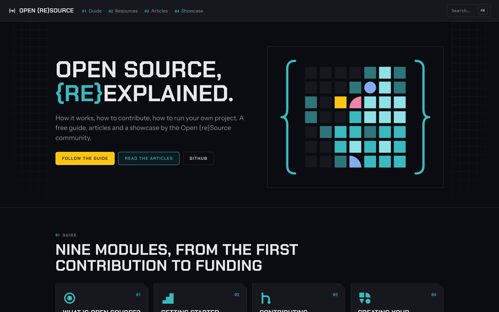

<h1 align="center">openresource.dev</h1>

<hr>

<p align="center">A free guide, articles and a showcase on how open source works, how to contribute and how to run your own project.</p>

<p align="center"><a href="https://openresource.dev"><strong>Open the guide »</strong></a></p>

<p align="center">
  <a href="https://openresource.dev/guide/">Guide</a>
  ·
  <a href="https://openresource.dev/articles/">Articles</a>
  ·
  <a href="https://discord.gg/fpUDwEMGwE">Discord</a>
  ·
  <a href="https://github.com/Open-reSource/openresource.dev/issues/new/choose">Report a bug</a>
</p>

<p align="center">
  <a href="LICENSE"></a>
</p>

<p align="center">
  <a href="https://openresource.dev"></a>
</p>

## What's in This Repository

"openresource.dev" is the repository containing the code source deployed to https://openresource.dev.

## Status

[](CODE_OF_CONDUCT.md)
[](https://github.com/Open-reSource/openresource.dev/actions/workflows/integration.yml)

## Quick Start

All commands are run from the root of the project, from a terminal:

| Command                              | Action                                                                                                                                       |
| :----------------------------------- | :------------------------------------------------------------------------------------------------------------------------------------------- |
| `npm install`                        | Installs dependencies                                                                                                                        |
| `npm run dev`                        | Run the development server at `localhost:4321`                                                                                               |
| `npm run build`                      | Build your production site                                                                                                                   |
| `npm run astro ...`                  | Run CLI commands like `astro add`, `astro check`                                                                                             |
| `npm run astro -- --help`            | Get help using the Astro CLI                                                                                                                 |
| `npm run update:showcase`            | Run the showcase script to gather GitHub and GitLab links from https://github.com/orgs/Open-reSource/discussions/3 (other links are ignored) |
| `npm run test`                       | Run the tests                                                                                                                                |
| `npm run shot -- <url> --out <name>` | Take a screenshot for the guide or an article (see [Screenshots](#screenshots))                                                              |
| `npm run prettier:check`             | Run Prettier to check the code style                                                                                                         |
| `npm run prettier:write`             | Run Prettier to fix the code style                                                                                                           |
| `npm run spellcheck`                 | Spell-check the content; add real words to `cspell.json`                                                                                     |
| `npm run links`                      | Check internal links and anchors in the last build (needs [lychee](https://lychee.cli.rs))                                                   |
| `npm run status`                     | Print a table of the guide's chapters: status, words, images, last update, reading time                                                      |

## Screenshots

Screenshots are taken the same way every time with `npm run shot`: a 1440×900 viewport at 2×, no browser chrome, always dark, saved to `public/images/` at 1440px wide max, as PNG or WebP when the PNG would be over 300 KB. Pages with a dark theme (GitHub) are shown in it; the others go through Chromium's auto dark mode. It uses Playwright's Chromium (`npx playwright install chromium` the first time).

```bash
npm run shot -- https://github.com/mdn/content/contribute --out contributing-finding-open-source-projects-1 --clip main --box 'a:has-text("Read the contributing guidelines")' --box 'main a:text-is("good first issue")'
```

| Option              | What it does                                                                                                                                                                     |
| :------------------ | :------------------------------------------------------------------------------------------------------------------------------------------------------------------------------- |
| `--out <name>`      | File name in `public/images/`, without extension: `<module>-<chapter>-<n>` for the guide, `<article>-<n>` for articles                                                           |
| `--clip <selector>` | Capture only this element                                                                                                                                                        |
| `--margin <px>`     | With `--clip`: keep that much of the page around the element, so a box flush with its edge keeps its number, and capture from the full page, so a sticky header doesn't cover it |
| `--box <selector>`  | Draw a gold box around each match, numbered when there are several (repeatable)                                                                                                  |
| `--wait <ms>`       | Wait after the page is loaded and scrolled to `--clip`, for pages that animate on scroll                                                                                         |

For GitHub pages that need an account, set `GH_SESSION` to the value of your `user_session` cookie on github.com. `tests/images.test.ts` fails on images over 1440px wide, over 1 MB, PNGs over 300 KB, or light images (mean brightness over 128/255). Images taken before the dark rule are listed in `tests/images.baseline.json`: retake one, then remove it from the list.

## Prose Checks

`tests/prose.test.ts` runs with `npm run test` and fails on:

- banned phrases: "In this chapter, we will", "In conclusion", "It's important to note", "Remember,", "essential", "crucial", "vibrant", "thriving", "delve", "landscape", "journey", "empower", "leverage", "In the simplest terms", "Here are some", "created equal", "Familiarize yourself with",
- an "Introduction" or "Conclusion" heading,
- a second `<p class="lead">` in a page (a closing recap),
- more than one exclamation mark in a page,
- `lastUpdate:` instead of `lastUpdated:` in the frontmatter.

Code blocks, inline code and URLs are skipped. Pages written before these rules are listed in `tests/prose.baseline.json` with their current counts: a count can go down, never up. After fixing a page, lower or remove its entry, or regenerate the file:

```bash
UPDATE_PROSE_BASELINE=1 npm run test -- --run prose
```

## Dependency Overrides

When a dependency pulls an outdated package with a security alert and its latest release still does, `package.json` pins the patched version under `overrides`, scoped to that dependency:

```json
"overrides": {
  "satori": { "fflate": "0.7.5" }
}
```

`tests/overrides.test.ts` fails as soon as an override is no longer needed: the dependency is gone, or now asks for the patched version itself. The update that makes an override useless has to remove it.

## Bugs and Feature Requests

Have a bug or a feature request? Please first search for existing and closed issues. If your problem or idea is not addressed yet, [please open a new issue](https://github.com/Open-reSource/openresource.dev/issues/new/choose).

## Contributing

Please read through our [contributing guidelines](https://github.com/Open-reSource/openresource.dev/blob/main/CONTRIBUTING.md).

## Community

Get an update on Open {re}Source's development and chat with the project maintainers and community members:

- Follow [@open_resource on X](https://x.com/open_resource).
- Follow [@openresource on Mastodon](https://fosstodon.org/@openresource).
- Follow [@openresource.dev on Bluesky](https://bsky.app/profile/openresource.dev).
- Follow [@openresource on Threads](https://www.threads.net/@openresource).
- Follow [@open-re-source on LinkedIn](https://www.linkedin.com/company/open-re-source/).
- Explore [our GitHub Discussions](https://github.com/orgs/Open-reSource/discussions).
- Chat with the community and the maintainers on [our Discord channel](https://discord.com/invite/fpUDwEMGwE).
- Use [our RSS feed](https://openresource.dev/rss.xml) to know when articles are out!

## Copyright and License

Code released under the [MIT License](LICENSE).

Content (including images) released under [CC BY-NC-SA 4.0](https://creativecommons.org/licenses/by-nc-sa/4.0/) ([full text](LICENSE-CONTENT)):

- `public` directory
- `src/assets` directory
- `src/content` directory

The Open {re}Source mark, favicons and artwork (`src/brand`, `src/assets/resources` and `public/covers` directories, `.github/header.*`) are not covered by these licenses: all rights reserved.

## Thanks

[](https://astro.build)

## Sponsors

<p align="center">
  <a href="https://github.com/sponsors/Open-reSource" aria-label="Go to Open {re}Source's GitHub Sponsors page">
    
  </a>
</p>
